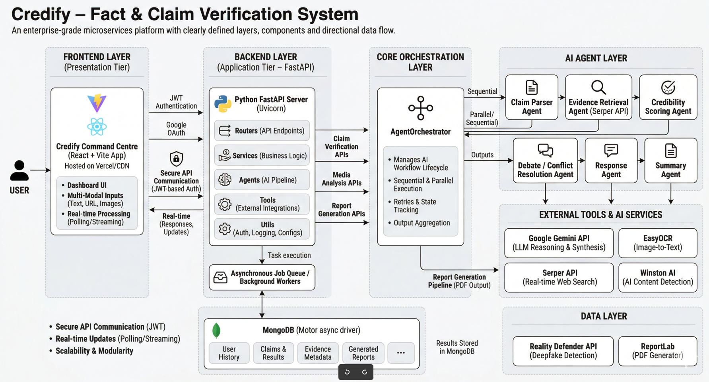
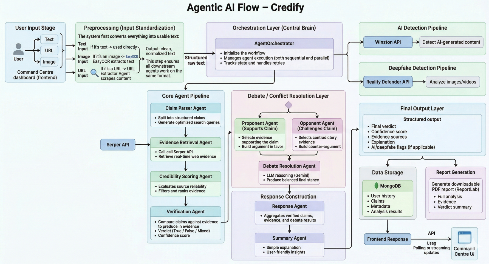

<div align="center">
  
  <h1>Credify – Fact & Claim Verification System</h1>
  <p><strong>Combat misinformation with an advanced, agentic AI verification pipeline.</strong></p>
</div>

---

## 📝 About Credify

**Credify** is an end-to-end, AI-powered fact-checking platform designed to automate the complex process of verifying information. It uses a **multi-agent orchestrator** to break down claims, perform real-time web searches, evaluate source credibility, and synthesize verifiable verdicts. From text and URLs to image-based media, Credify provides deep insights into the veracity of content in the modern digital landscape.

## ✨ Key Features

- **Multi-Modal Input:** Verify claims via text, URLs, image uploads, or **Voice input (Speech-to-Text)**.
- **Agentic Fact-Checking:** A sophisticated multi-agent system orchestrating claim parsing, evidence retrieval, credibility scoring, and verification.
- **AI-Generated Text Detection:** Seamlessly identify if a piece of text was likely written by AI (ChatGPT, Claude, etc).
- **Deepfake Media Detection:** Scan images to detect AI-generated or manipulated media.
- **Comprehensive PDF Reports:** Generate and download detailed, professional PDF reports of analysis results.
- **Inclusive Accessibility:** Built-in multi-language support, Text-to-Speech (TTS), Speech-to-Text (STT), and Dyslexia-Friendly Mode for improved readability.

---

### 🏗️ Architecture



#### Backend (FastAPI)

- **Scalable Architecture:** Modular project structure inside the `app/` subfolder:
  - `core/`: Application settings and global configuration.
  - `routers/`: API route definitions.
  - `services/`: Business logic layer separating logic from transport.
  - `models/`: Centralized Pydantic data models and Database schemas.
  - `agents/`: AI agents dedicated to processing claims and summarization.
  - `tools/`: Reusable tools (e.g. Real-Time Search, PDF Generator) used by the agents.
  - `utils/`: High-performance utility modules (Logger, Auth, LLM, Mongo).
- **Async Database Driver:** Uses `motor` for high-performance MongoDB interactions.
- **Security:** JWT Authentication with `python-jose` and `passlib` (bcrypt).
- **Multi-Agent System:** Advanced AI pipeline orchestrating Gemini models and Real-Time external Search APIs (Serper) to perform verifiable fact-checking, complete with token streaming.
- **Deepfake Detection Engine:** Dedicated endpoints and processing for analyzing media for manipulation.

#### Frontend (React + Vite)

- **Dashboard UI:** A clean, command-center inspired dashboard showcasing dynamic interaction, responsive metrics, and personalized user history.
- **Context API:** Global authentication state management via `AuthContext`.
- **Protected Routes:** Dashboard access restricted to authenticated users.
- **Animations:** Smooth transitions using `framer-motion`.

---

### 🤖 The Agentic Flow



Credify's core is powered by an orchestrator-driven multi-agent system that parallelizes claim verification. From user input to final output, the process involves:

1. **Claim Parser Agent**: Decomposes raw user input into distinct, structurally verifiable claims and optimal search queries.
2. **Evidence Retrieval Agent**: Interfaces with external search tools (e.g. Serper API) to gather real-world news and raw data related to the claims.
3. **Credibility Scoring Agent**: Evaluates the retrieved search results for reliability and factual consistency, ranking the best sources.
4. **Verification Agent**: Analyzes the claims specifically against the high-scored evidence to formulate an initial verdict and calculate a confidence score.
5. **Debate Agent**: Simulates multi-perspective reasoning by creating a Proponent vs. Opponent scenario to handle conflicting evidence and strengthen the final verdict.
6. **Response Agent**: Aggregates the gathered evidence and verification contexts to establish the final verifiable conclusion and reasoning.
7. **Summary Agent**: Condenses the extensive technical analysis into an easily digestible, user-friendly summary.

These agents are seamlessly managed by an orchestrator which safely runs parallel execution, resolving race conditions with atomic database updates, and synchronously streaming updates to the dashboard UI.

---

## 🛠️ Tech Stack

- **Frontend:** React, Vite, Axios, Framer Motion, Lucide Icons
- **Backend:** FastAPI, Uvicorn, Motor (MongoDB), Pydantic, Agentic Flow, Serper API, ReportLab (PDF Generation)
- **Auth:** JWT, Google OAuth 2.0
- **Database:** MongoDB

---
## 🚀 Quick Start

Follow these steps to get the project up and running.

### 1. Prerequisites

- **Node.js** (v18+)
- **Python** (v3.8+)
- **MongoDB** (Running locally or on Atlas)

### 2. Setup

Run the appropriate command for your OS in the root directory to install all dependencies and create the Python virtual environment:

#### 🐧 Linux/macOS

```bash
npm run install:linux
```

#### 🪟 Windows

```bash
npm run install:windows
```

### 3. Environment Configuration

Create `.env` files for both backend and frontend using the provided examples.

#### 🖥️ Backend (`backend/.env`)

Create this file and add the following:

```env
PROJECT_NAME=Credify
FAST_API_PORT=8000
MONGO_URI=mongodb://localhost:27017
DATABASE_NAME=credify_db
JWT_SECRET=your_super_secret_jwt_key
JWT_ALGORITHM=HS256
GOOGLE_CLIENT_ID=your_google_client_id
GOOGLE_CLIENT_SECRET=your_google_client_secret
ACCESS_TOKEN_EXPIRE_MINUTES=43200
GEMINI_API_KEY=your_gemini_api_key
GROQ_API_KEY=your_groq_api_key
SERPER_API_KEY=your_serper_api_key
WINSTON_API_KEY=your_winston_api_key
REALITY_DEFENDER_API_KEY=your_reality_defender_api_key
```

#### 🌐 Frontend (`frontend/.env`)

Create this file and add the following:

```env
VITE_API_BASE_URL=http://localhost:8000
VITE_GOOGLE_CLIENT_ID=your_google_client_id
VITE_APP_NAME=Credify
```

#### 🔑 External API Keys Use Cases

- **`GEMINI_API_KEY`**: Powers the core LLM agents using Google Gemini models.
- **`GROQ_API_KEY`**: Powers the core LLM agents using Groq's high-performance models (e.g. Llama 3, Mixtral).
- **`SERPER_API_KEY`**: Powers the Evidence Retrieval Agent allowing it to perform real-time Google search queries to gather external evidence.
- **`WINSTON_API_KEY`**: Utilized by the AI Detection Engine to scan given text and identify if it is AI-generated (e.g. ChatGPT, Claude, etc).
- **`REALITY_DEFENDER_API_KEY`**: Utilized by the Deepfake Detection Engine to scan images and videos for signs of AI-manipulation or deepfakes.

---

### 4. Running the Project

You can run both the frontend and backend concurrently:

#### 🐧 Execution: Linux/macOS

```bash
npm run dev:linux
```

#### 🪟 Execution: Windows

```bash
npm run dev:windows
```

Alternatively, you can run them separately:

- **Backend (Dev):** `npm run backend:linux` or `npm run backend:windows`
- **Backend (Prod):** `npm run backend:prod` (Runs with multi-worker support)
- **Frontend:** `npm run frontend`

The Backend will run on [http://localhost:8000](http://localhost:8000) (as configured in `.env`) and the Frontend on [http://localhost:5173](http://localhost:5173).

---

### 📖 API Documentation

FastAPI provides built-in interactive API documentation:

- **Swagger UI:** [http://localhost:8000/docs](http://localhost:8000/docs) — Interactive testing of all endpoints.
- **ReDoc:** [http://localhost:8000/redoc](http://localhost:8000/redoc) — Clean, structured API documentation.

### ⚙️ Backend Runner (`run.py`)
The backend includes a dedicated `run.py` script for advanced management:
- `--env development`: Enables hot-reload and debug logging.
- `--env production`: Optimizes for performance.
- `--workers N`: Sets the number of worker processes in production mode.
- `--llm [gemini|groq]`: Selects the LLM provider at runtime (default: `gemini`).

---

Developed with ❤️ by Team Tristar.
